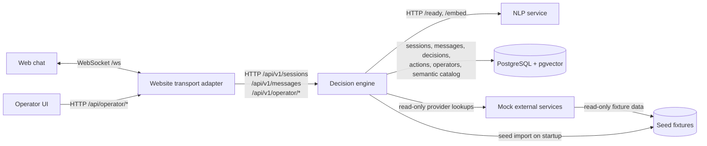

# Component Diagram

The decision engine owns session restoration, message persistence, decisions,
action execution, operator handoff state, readiness, and the HTTP v1 contract.
The website adapter owns the browser WebSocket contract and proxies operator UI
HTTP calls. The NLP service supplies 384-dimensional embeddings for semantic
intent and knowledge lookup. Mock external services expose read-only provider
contracts for booking, workspace booking, payment, user account, and pricing
scenarios; the demo never mutates those external fixtures.
