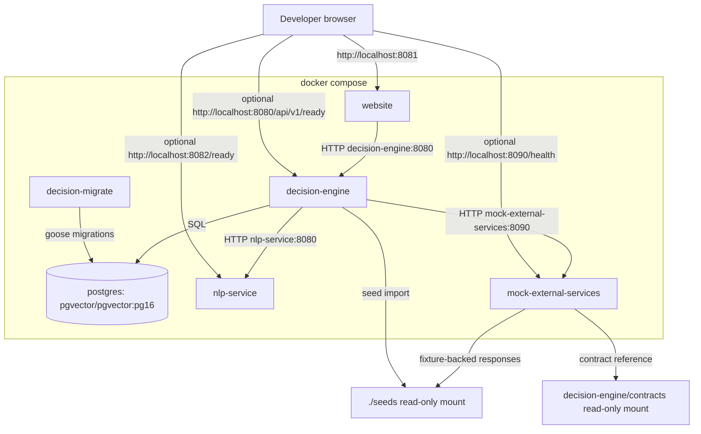

# Deployment Diagram

Default published ports are 5442 for Postgres, 8080 for decision-engine, 8081
for website, 8082 for NLP, and 8090 for mock external services. The website
container is the browser entry point; direct service ports are used by health
checks, E2E tests, and manual diagnostics.
