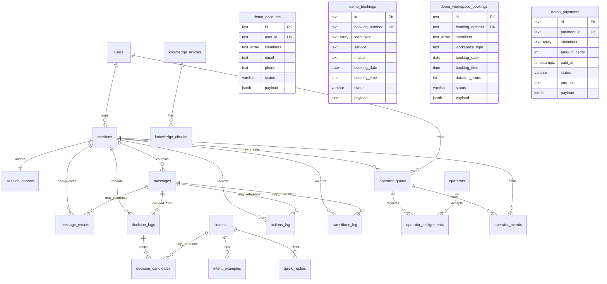

# ERD

The exact table definitions are in `services/decision-engine/migrations/`.
`intent_examples` and `knowledge_chunks` store `vector(384)` embeddings with
HNSW cosine indexes. `session_context` is kept in sync from `sessions` by a
trigger and is also updated by runtime context decisions. Demo provider tables
are independent fixture-backed lookup tables; the migrations do not define a
shared demo user table.
