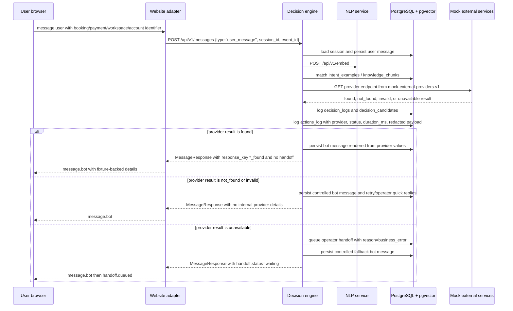

# Business Lookup Sequence

The lookup action set is fixture-backed and read-only: `find_booking`,
`find_workspace_booking`, `find_payment`, and `find_user_account`. Provider
evidence is stored in `actions_log`; user-facing responses use safe text and do
not expose SQL, panic, or upstream internals.
