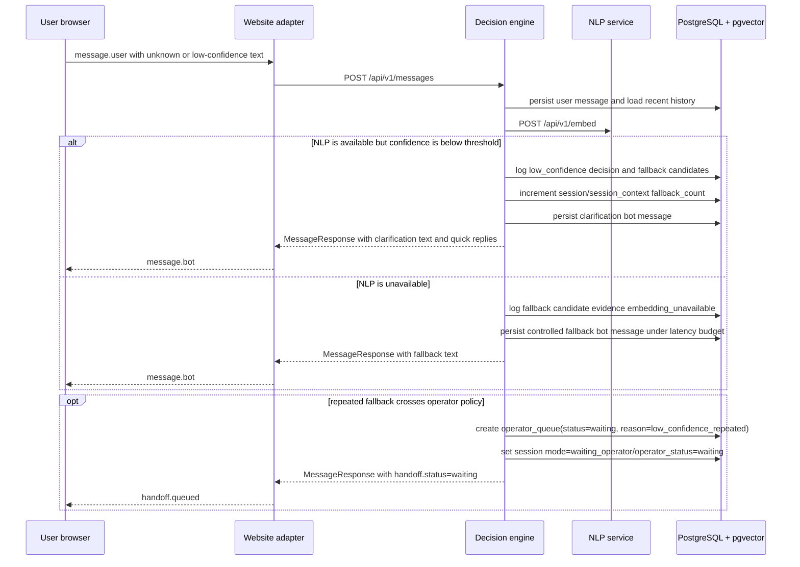

# Fallback Sequence

Fallback remains controlled and persisted. It does not call an LLM runtime and
does not silently drop the user message; E2E coverage asserts fallback evidence
and the under-three-second degraded NLP path.
