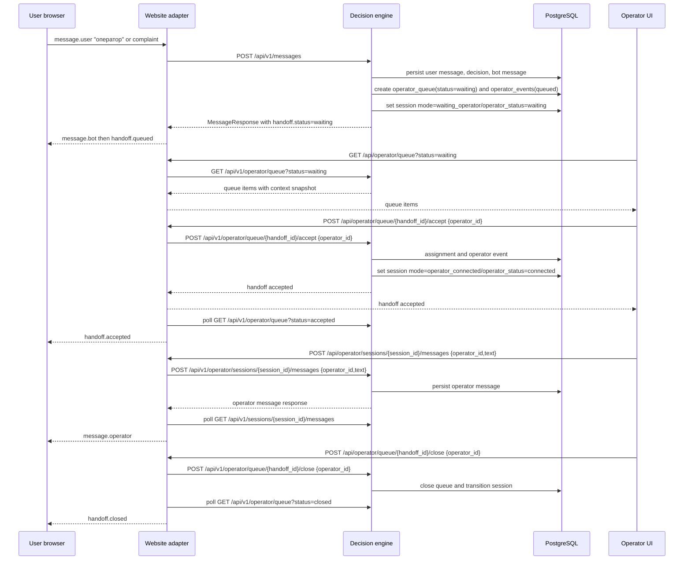

# Operator Handoff Sequence

```mermaid
sequenceDiagram
  participant U as User browser
  participant W as Website adapter
  participant D as Decision engine
  participant P as PostgreSQL
  participant O as Operator UI

  U->>W: message.user "оператор" or complaint
  W->>D: POST /api/v1/messages
  D->>P: persist user message, decision, bot message
  D->>P: create operator_queue(status=waiting) and operator_events(queued)
  D->>P: set session mode=waiting_operator/operator_status=waiting
  D-->>W: MessageResponse with handoff.status=waiting
  W-->>U: message.bot then handoff.queued
  O->>W: GET /api/operator/queue?status=waiting
  W->>D: GET /api/v1/operator/queue?status=waiting
  D-->>W: queue items with context snapshot
  W-->>O: queue items
  O->>W: POST /api/operator/queue/{handoff_id}/accept {operator_id}
  W->>D: POST /api/v1/operator/queue/{handoff_id}/accept {operator_id}
  D->>P: assignment and operator event
  D->>P: set session mode=operator_connected/operator_status=connected
  D-->>W: handoff accepted
  W-->>O: handoff accepted
  W->>D: poll GET /api/v1/operator/queue?status=accepted
  W-->>U: handoff.accepted
  O->>W: POST /api/operator/sessions/{session_id}/messages {operator_id,text}
  W->>D: POST /api/v1/operator/sessions/{session_id}/messages {operator_id,text}
  D->>P: persist operator message
  D-->>W: operator message response
  W->>D: poll GET /api/v1/sessions/{session_id}/messages
  W-->>U: message.operator
  O->>W: POST /api/operator/queue/{handoff_id}/close {operator_id}
  W->>D: POST /api/v1/operator/queue/{handoff_id}/close {operator_id}
  D->>P: close queue and transition session
  W->>D: poll GET /api/v1/operator/queue?status=closed
  W-->>U: handoff.closed
```

While the session is in operator mode, user messages are routed to the operator
path and the bot must not auto-answer.
