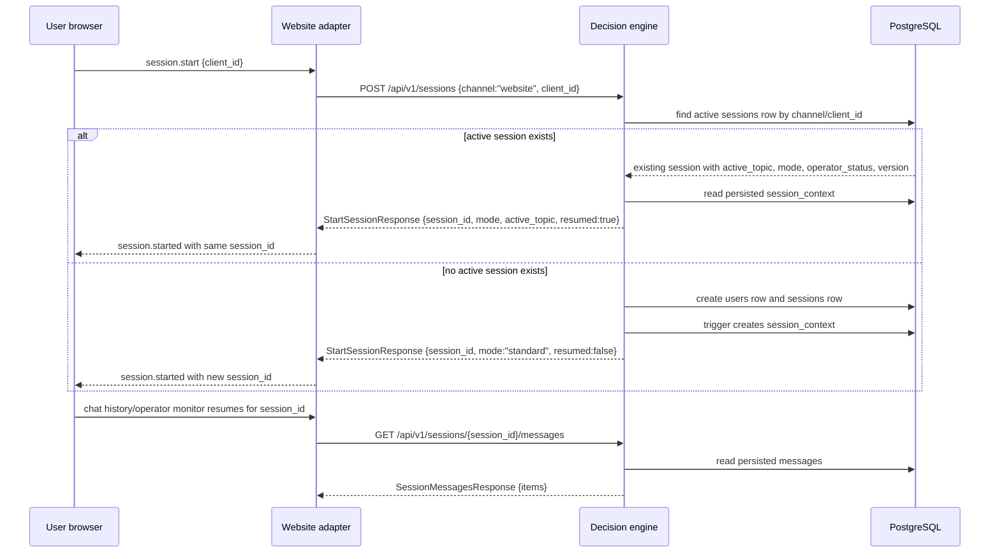

# Restore Sequence

Restart recovery relies on Postgres state, not in-memory website state. The E2E
restore flow restarts `decision-engine` and `website`, starts a session with the
same `client_id`, and expects the same `session_id`, `resumed:true`, unchanged
message count, and preserved `active_topic`.
