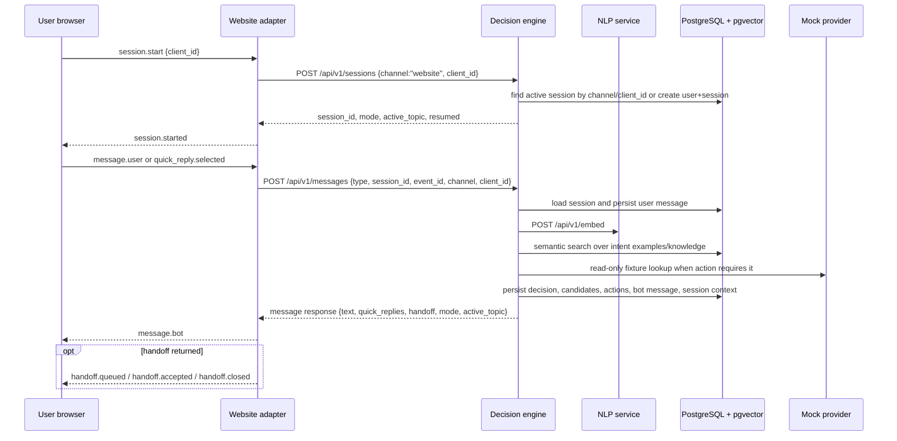

# User Message Sequence

```mermaid
sequenceDiagram
  participant U as User browser
  participant W as Website adapter
  participant D as Decision engine
  participant N as NLP service
  participant P as PostgreSQL + pgvector
  participant M as Mock provider

  U->>W: session.start {client_id}
  W->>D: POST /api/v1/sessions {channel:"website", client_id}
  D->>P: find active session by channel/client_id or create user+session
  D-->>W: session_id, mode, active_topic, resumed
  W-->>U: session.started
  U->>W: message.user or quick_reply.selected
  W->>D: POST /api/v1/messages {type, session_id, event_id, channel, client_id}
  D->>P: load session and persist user message
  D->>N: POST /api/v1/embed
  D->>P: semantic search over intent examples/knowledge
  D->>M: read-only fixture lookup when action requires it
  D->>P: persist decision, candidates, actions, bot message, session context
  D-->>W: message response {text, quick_replies, handoff, mode, active_topic}
  W-->>U: message.bot
  opt handoff returned
    W-->>U: handoff.queued / handoff.accepted / handoff.closed
  end
```

All business provider calls in the demo are read-only fixture lookups. No real
payment, CRM, booking, account, workspace, or pricing mutation occurs.
